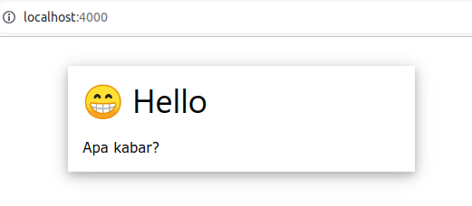
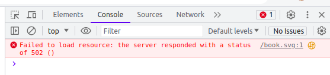

Create exactly one file, main.tsx.

```tsx
import express from "https://esm.sh/v132/express@4.18.2";

const PORT = 4000;
const app = express();

app.use(express.static(Deno.cwd() + "/public"));

app.get("/", (req: Request, res: Response) => {
    res.type("text/html");
    res.send(`<h1>😁 Hello</h1>`);
});

console.log(`Listening to port: ${PORT}`);
app.listen(PORT);
```

And run it using:

```console
deno run -A --watch ./main.tsx
```

Everything will be fine, because we do not use anything special, and the `public` directory is empty.

## Step 2

Now, create the public directory, and store some image for icon inside. Here I am
using 'book.svg'.


I know, it's too big! But just leave it as it is for now.

Next, change the file `main.tsx` into something like this:

```tsx
/** @jsxImportSource https://esm.sh/preact */
import express from "https://esm.sh/v132/express@4.18.2";
import renderToString from "https://esm.sh/v132/preact-render-to-string@6.2.1/src/index.js";

const PORT = 4000;
const app = express();

function Home(props) {
    return (
        <html lang="en">
        <head>
        <meta charset="UTF-8"/>
        <meta name="viewport" content="width=device-width, initial-scale=1.0"/>
        <title>{props.title}</title>
        <link rel="stylesheet" href="https://www.w3schools.com/w3css/4/w3.css"/>
        <link rel="icon" type="image/svg+xml" href="/book.svg"/>
        </head>
        <body>
            <main class="w3-main w3-padding-32">
                <header class="w3-container w3-content w3-card-4" style="width:50%;">
                    <h1>{props.title}</h1>
                    <p>{props.message}</p>
                </header>
            </main>
        </body>
        </html>
    );
}

app.use(express.static(Deno.cwd() + "/public"));

app.get("/", (req: Request, res: Response) => {
    res.type("text/html");
    res.send("<!doctype html>\n" + renderToString(<Home title="😁 Hello" message="Apa kabar?"/>));
});

console.log(`Listening to port: ${PORT}`);
app.listen(PORT);
```



It is still okay, it works!

But, try to deploy it to Deno Deploy, and use the 'Inspect' from context menu, switch to 'Console'.



